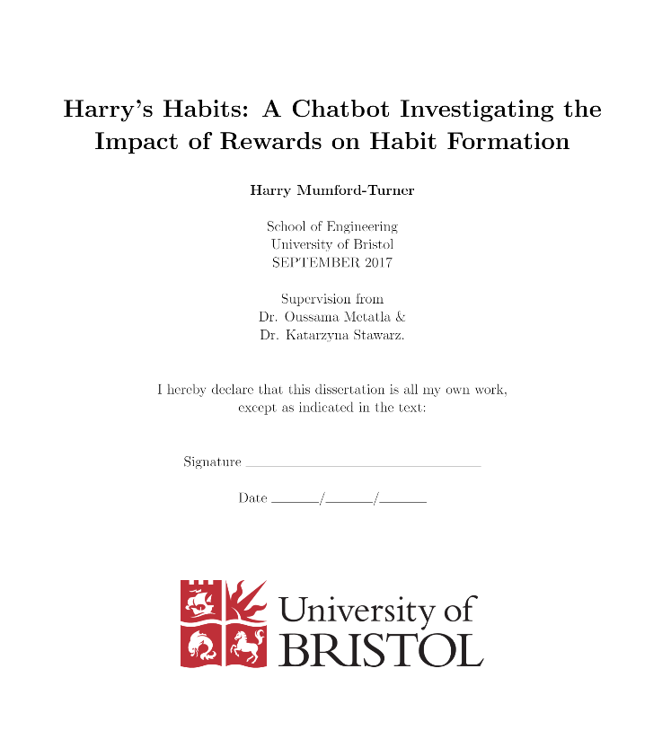

## Masters Thesis

Written at the University of Bristol for my MSc Advanced Computer Science [thesis](thesis.pdf).
I built a [chatbot](https://github.com/harrymt/harryshabits) to help people form new positive habits by deliving different types of positive reinforcement rewards.

    

## Implementation

As part of this thesis a conference paper was written and the fully working chatbot was built and open sourced:

- [CHI2018 Paper](https://github.com/harrymt/harryshabits-chi): Human Computer Interaction 2018 Conference paper.
- [ChatBot](https://github.com/harrymt/harryshabits): Facebook Messenger Chatbot

## Overview

[Visual poster](poster.pdf).

Habit formation technologies use rewards and points as means for providing positive reinforcement, often in the format of visual or audio rewards such as jingles, badges or animations. Providing the right reward increases the chances for developing a new habit; yet, research on how these rewards should be delivered and the impact that this has on the process of habit formation is scarce. In this thesis we investigate how three types of positive reinforcement (visual, auditory, visual-auditory) influence habit performance and automaticity. Sixty people participated in a 4-week study where a custom built chatbot was used to deliver different types of positive reinforcement rewards for completing a new daily habit. The results reported higher habit performance rates when a reward was present without necessarily increasing behaviour automaticity. This has implications for the design of habit formation technologies that rely on visual and auditory rewards as means of positive reinforcement.
